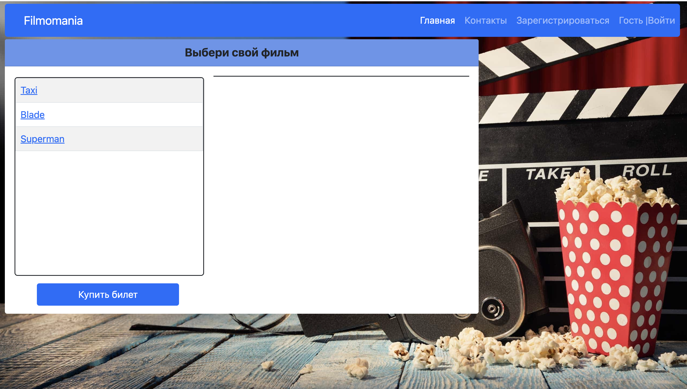
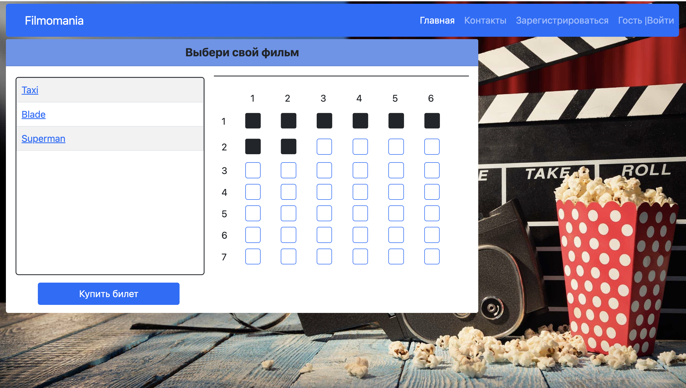
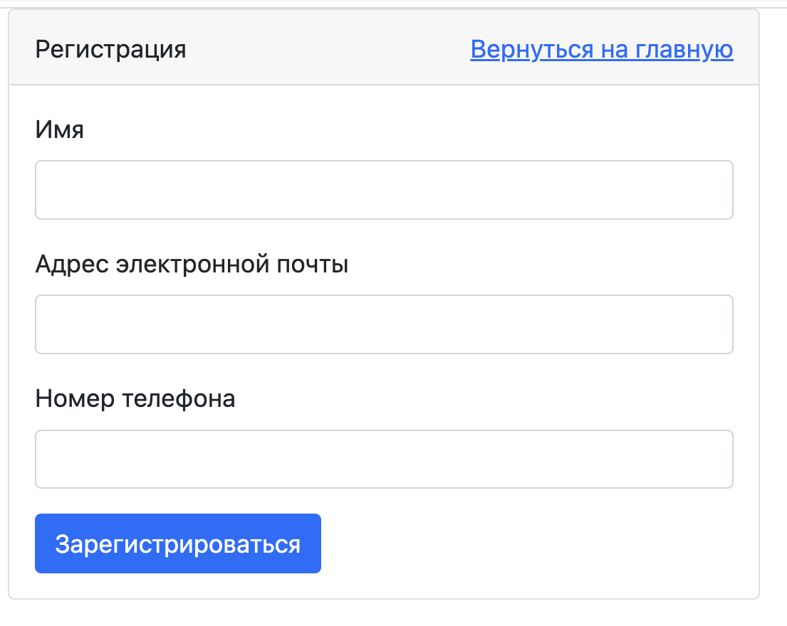
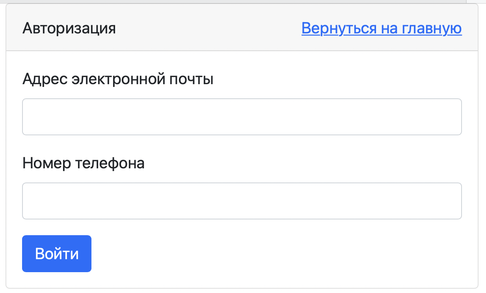
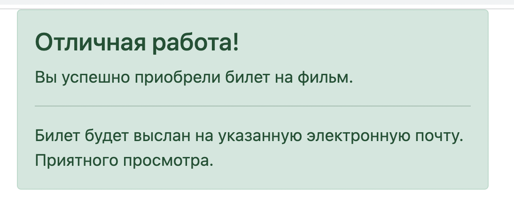
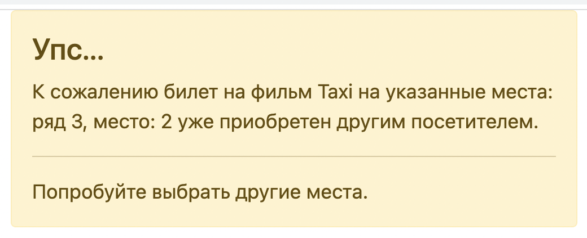

#job4j_cinema

# Cinema
## О проекте

Данный проект является учебным и представлет собой
сайт для покупки билетов в кинотеатр.
При реализации сервиса использованы Spring Boot,
Thymeleaf, Bootstrap, JDBC. Загрузка базы
данных осуществляется с помощью Liquibase.

## Запуск приложения

1. Запустите метод main() в классе Main.
2. Откройте браузер и перейдите по ссылке 
http://localhost:8080/index

## Использование

На главной странице отображена форма со списком фильмов.

При нажатии на поле с названием фильма отображается 
схема наличия свободных мест.

Для приобретения билета нужно отметить необходимые места
и нажать кнопку "Купить билет". Для покупки билета пользователь должен
быть авторизован, в противном случае будет отображена страница
с формой для авторизации и информационным сообщением.

В правой части навигационной панели отображается
имя пользователя. В случае, если пользователь не 
авторизирован, имя пользователя будет указано как "Гость".

Для регистрации необходимо выбрать пункт меню "Зарегистрироваться".
Откроется страница с формой регистрации.
Далее необходимо внести учетные данные и нажать кнопку "Зарегистрироваться".

Для авторизации необходимо выбрать пункт меню "Войти"
и внести свои учетные данные.

В случае удачной покупки билета, будет отображена страница 
с информацией об удачном результате покупки.

В случае если билет уже приобретен другим пользователем,
будет выведена соответствующая информация.

